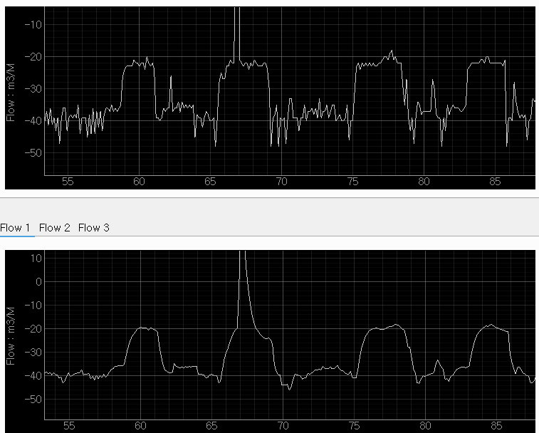

# PDDAU_V1.1 Virtual PDDAU Python Implementation

... <br>
... <br>

## Act as a virtual PDDAU over local network.

# Requirement
Listen to port 5000 on a PDDAU compatible TCP server. After connection wait for 
commands. 

# Ubuntu 22.xx wayland PyQt5 xcb errors sanion_python_projects
Install Setup Tools
sudo apt install python-setuptools
sudo apt install python3.10-distutils

sudo apt install libxcb-cursor0

If Qt5 installed earlier by pycharm then uninstall by following commands
sudo python3 /snap/pycharm-community/439/plugins/python-ce/helpers/packaging_tool.py uninstall PyQt5
do same for PyQt5-Qt5, PyQt5_sip, QtPy, qtmodern, pyqtgraph, 

echo $XDG_SESSION_TYPE # Should be x11 or wayland

sudo nano /etc/gdm3/custom.conf
add
WaylandEnable=false

sudo nano /etc/environment
#### Add QT_QPA_PLATFORM=xcb
#### Or No need to edit, 

sudo apt-get install '^libxcb.*-dev' libx11-xcb-dev libglu1-mesa-dev libxrender-dev libxi-dev libxkbcommon-dev libxkbcommon-x11-dev


# Research and Analysis
Tesla Partial Discharge Applied to Microwave antenna tuned around 6GHz.
PDDAU module is 4 channel combined a RF downconverter and RF Preamplifier.
Antenna connected to PDDAU module as below: <br> <br>
<br><br>

Test setup to capture PD signal. <br><br>
<br><br>

Data captured in web based signal viewer as below: <br><br>

<br><br>

This is a single cycle, which is 1/60 second. 


### Final code will be merged into wavegenA_PD_FILTER_GRAPH. <br>
The wavegenA project was organised for reading PD file or any binary data file and show 
the graph. Present tool (wavegenA_PD_FILTER_GRAPH) will show or animate the PD data and 
Filtered PD Data. Practically 2 graph top bottom at beggining stage. The main wavegenA 
project can Initiate a File Open Dialog and show a window (mimic.py) which is only 3 tab 
window where 2nd tab contains the QGraphicsView Container. <br>

This version allows user to select a folder and it lists all the files of the folder in a 
list view. After selecting a folder a dictionary 'self.file_path_dictionary' kept all the files 
path as value with file names as keys. 
<br>
After select a folder the Treeview at left side will show the list of files. User can select 
any file. The file processing takes about 10 to 15 second. Then it will show the original original 
signal and the filtered signal in top and bottom graph. <br>
<br><br>

After some changes in the filter parameters, here is the output again:
```Python
    def showKalmann(self):
        bytesArray = self.binfil.getArray()
        dt = 1000.0 / 7680.0
        F = np.array([[1, dt, 0], [0, 1, dt], [0, 0, 1]])
        H = np.array([1, 0, 0]).reshape(1, 3)
        Q = np.array([[0.09, 0.09, 0.0], [0.09, 0.09, 0.0], [0.0, 0.0, 0.0]])
        R = np.array([1]).reshape(1, 1)
        self.kalmann = KalmanFilter(F=F, H=H, Q=Q, R=R)
        self.injectDataStreamToGraph()
```
<br><br>


```Python
```
