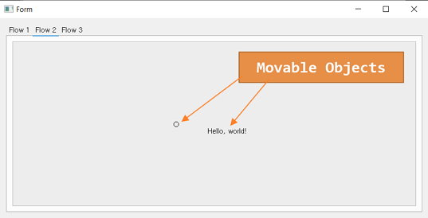

# WAVEGEN Function Generator

... <br>
... <br>

As of my concept, QGraphicsView and QGraphicsScene can work together to 
form a wave shape composer. Actually QGraphicsScene can contain multiple 
types of graphics item as a container, then QGraphicsView can help visualize 
the items. mimic.py is just a window of 3 tabs for now. The 2nd tab contains 
the QGraphicsView Container. We may need to inherit QGraphicsScene for 
wave shape drawing functionality. <br>

<br><br>

## PD Data Filter Graph from Flowmeter_PD_FILTER_GRAPH and wavegenA_PD_FILTER_GRAPH <br>

### Final code will be merged into wavegenA_PD_FILTER_GRAPH. <br>
The wavegenA project was organised for reading PD file or any binary data file and show 
the graph. Present tool (wavegenA_PD_FILTER_GRAPH) will show or animate the PD data and 
Filtered PD Data. Practically 2 graph top bottom at beggining stage. The main wavegenA 
project can Initiate a File Open Dialog and show a window (mimic.py) which is only 3 tab 
window where 2nd tab contains the QGraphicsView Container.


```Python
```
