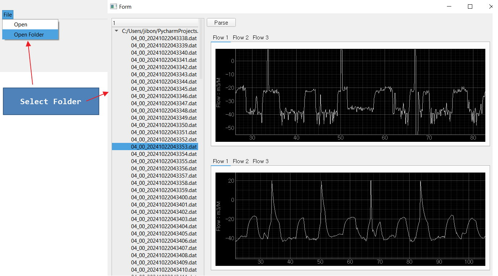

# WAVEGEN Raw Data and Filter Data Comparison

... <br>
... <br>

## This Project is derived from PD Data Filter Graph from Flowmeter_PD_FILTER_GRAPH and wavegenA_PD_FILTER_GRAPH <br>

# Recent Update :: Date 19-Mar-2025
Since Larger binary file needed to be inspected, The Append(...) function in charttab.py takes longer time when 
assigning large data in a Loop. So a new function has been introduced to load only a portion of the file into 
chart in comparison_chart.py : def injectRawDataStreamToGraphSize(self, _size): .

# Requirement
PD data analysis in graph before filter and after filter. 
This task will do the kalman filter for now. Later we can apply more advanced filters.

# Research and Analysis
Tesla Partial Discharge Applied to Microwave antenna tuned around 6GHz.
PDDAU module is 4 channel combined a RF downconverter and RF Preamplifier.
Antenna connected to PDDAU module as below: <br> <br>
<br><br>

Test setup to capture PD signal. <br><br>
<br><br>

Data captured in web based signal viewer as below: <br><br>

<br><br>

This is a single cycle, which is 1/60 second. 


### Final code will be merged into wavegenA_PD_FILTER_GRAPH. <br>
The wavegenA project was organised for reading PD file or any binary data file and show 
the graph. Present tool (wavegenA_PD_FILTER_GRAPH) will show or animate the PD data and 
Filtered PD Data. Practically 2 graph top bottom at beggining stage. The main wavegenA 
project can Initiate a File Open Dialog and show a window (mimic.py) which is only 3 tab 
window where 2nd tab contains the QGraphicsView Container. <br>

This version allows user to select a folder and it lists all the files of the folder in a 
list view. After selecting a folder a dictionary 'self.file_path_dictionary' kept all the files 
path as value with file names as keys. 
<br>
After select a folder the Treeview at left side will show the list of files. User can select 
any file. The file processing takes about 10 to 15 second. Then it will show the original original 
signal and the filtered signal in top and bottom graph. <br>
<br><br>

After some changes in the filter parameters, here is the output again:
```Python
    def showKalmann(self):
        bytesArray = self.binfil.getArray()
        dt = 1000.0 / 7680.0
        F = np.array([[1, dt, 0], [0, 1, dt], [0, 0, 1]])
        H = np.array([1, 0, 0]).reshape(1, 3)
        Q = np.array([[0.09, 0.09, 0.0], [0.09, 0.09, 0.0], [0.0, 0.0, 0.0]])
        R = np.array([1]).reshape(1, 1)
        self.kalmann = KalmanFilter(F=F, H=H, Q=Q, R=R)
        self.injectDataStreamToGraph()
```
<br><br>


```Python
```
